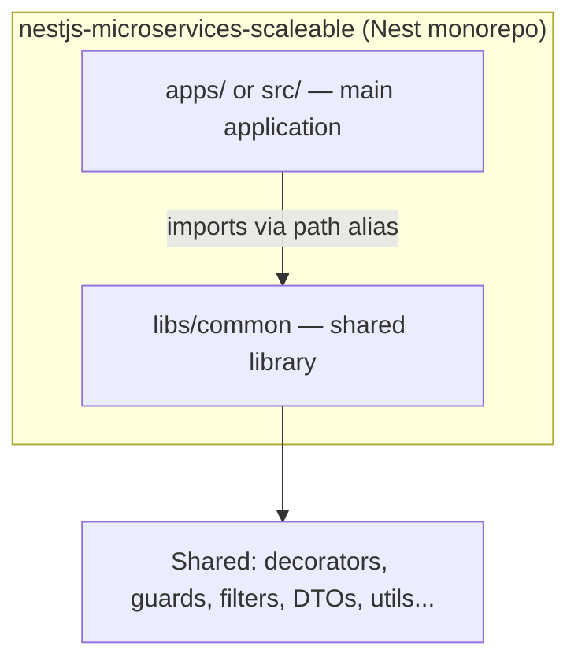
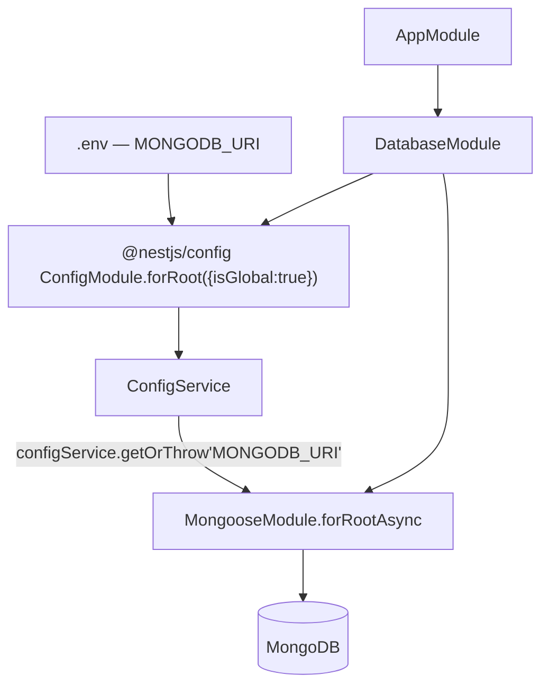

# nestjs-microservices-scaleable — Build Log

> Running, step-by-step record of everything done on this project, in order. Updated as we go.

---

## 📋 Steps Index

| # | Step | Purpose | Status |
|---|---|---|---|
| 1 | [Create the Nest App (Monorepo Mode)](#step-1--create-the-nest-app-monorepo-mode) | Lay the foundation as a monorepo so shared code can live in `libs/` and be reused by future services | ✅ Done |
| 2 | [Generate the `common` Library](#step-2--generate-the-common-library) | Create the shared-code home (`@app/common`) that every future module/service will import from | ✅ Done |
| 3 | [Config Module + Database Module (Mongoose + Joi)](#step-3--config-module--database-module-mongoose--joi) | Validate required env vars and connect the app to MongoDB | ⚠️ Done, wiring gap open |

---

## Big Picture — Monorepo Structure



**Why monorepo mode:** a `libs/` folder means this isn't a single Nest app — it's set up so multiple services (or one app + shared code) live in one repo and reuse the same compiled TypeScript path aliases, instead of publishing an npm package for shared code.

---
---

# 🟦 STEP 1 — Create the Nest App (Monorepo Mode)

🎯 **Purpose:** start the project in **monorepo mode** (not a single-app mode) so that from day one there's a `libs/` folder for shared code — the base this whole "scalable microservices" setup depends on.

```bash
nest new nestjs-microservices-scaleable
```

**What this generated:**
- `src/` — the main application (`main.ts`, `app.module.ts`, `app.controller.ts`, `app.service.ts`)
- `nest-cli.json` — the monorepo config file, currently:

```json
{
  "collection": "@nestjs/schematics",
  "sourceRoot": "src",
  "compilerOptions": { "deleteOutDir": true, "builder": "rspack" }
}
```

📌 **Notable non-default choices already in `package.json`:**

| Choice | What you have | Default Nest starter uses |
|---|---|---|
| Bundler | `rspack` (`@rspack/core`) | webpack |
| Test runner | `vitest` | jest |
| Linter | `oxlint` | eslint |
| Module system | `"type": "module"` (ESM) | CommonJS |
| Config validation | `joi` | (none by default) |
| Nest version | `^12.0.1` | — |

---
---

# 🟦 STEP 2 — Generate the `common` Library

🎯 **Purpose:** create one shared package (`@app/common`) that any future app or microservice in this repo can import from — decorators, guards, DTOs, the config/database modules from Step 3 — instead of copy-pasting shared code into each service or publishing an internal npm package.

```bash
nest g library common
```

**What this changed:**

```
libs/
└── common/
    ├── src/
    │   └── index.ts          # barrel file — re-export everything shared from here
    └── tsconfig.lib.json
```

`nest-cli.json` gained a `projects` entry:

```json
"projects": {
  "common": {
    "type": "library",
    "root": "libs/common",
    "entryFile": "index",
    "sourceRoot": "libs/common/src",
    "compilerOptions": { "tsConfigPath": "libs/common/tsconfig.lib.json" }
  }
}
```

**Why a library instead of a plain shared folder:** `nest g library` wires up a TypeScript path alias (e.g. `@app/common`) automatically, so any future app/service in this monorepo can `import { X } from '@app/common'` instead of a relative `../../../libs/common/...` path — this is what makes it scale to multiple microservices later.

---
---

# 🟦 STEP 3 — Config Module + Database Module (Mongoose + Joi)

🎯 **Purpose:** two separate concerns, both required before any real feature module can exist —
1. **Config Module:** make sure the app refuses to boot if a required env var (`MONGODB_URI`) is missing, instead of crashing later with a confusing runtime error.
2. **Database Module:** actually open the MongoDB connection via Mongoose, driven by that validated config, so feature modules (users, products, etc.) can start using `@InjectModel()`.



**Files added, both inside `libs/common/src/`:**

```
libs/common/src/
├── config/
│   └── config.module.ts      → nest g module config --project common   (or hand-written, as here)
└── database/
    └── database.module.ts    → nest g module database --project common
```

### 3.1 — `config/config.module.ts`

```typescript
import { Module } from '@nestjs/common';
import { ConfigModule as NestConfigModule } from '@nestjs/config';
import Joi from 'joi';

@Module({
  imports: [
    NestConfigModule.forRoot({
      // WHY: fail fast at boot if MONGODB_URI is missing, instead of
      // getting a confusing Mongoose connection error later
      validationSchema: Joi.object({
        MONGODB_URI: Joi.string().required(),
      }),
    }),
  ],
})
export class ConfigModule {}
```

### 3.2 — `database/database.module.ts`

```typescript
import { Module } from '@nestjs/common';
import { MongooseModule } from '@nestjs/mongoose';
import { ConfigModule, ConfigService } from '@nestjs/config';

@Module({
  imports: [
    ConfigModule.forRoot({ isGlobal: true }),

    MongooseModule.forRootAsync({
      imports: [ConfigModule],
      inject: [ConfigService],
      // WHY forRootAsync instead of forRoot: the URI comes from ConfigService,
      // which isn't ready at module-definition time — async factory waits for it
      useFactory: (configService: ConfigService) => ({
        uri: configService.getOrThrow<string>('MONGODB_URI'),
      }),
    }),
  ],
})
export class DatabaseModule {}
```

### 3.3 — Wired into the app

```typescript
// src/app.module.ts
import { DatabaseModule } from '@app/common/database/database.module.js';

@Module({
  imports: [
    // ...ObserveModule...
    DatabaseModule,
  ],
})
```

📦 **Packages used here (already in `package.json`, none new):** `@nestjs/config`, `@nestjs/mongoose`, `mongoose`, `joi`.

| File | Usage |
|---|---|
| `config/config.module.ts` | A `ConfigModule` that validates `.env` against a Joi schema before the app boots — currently only checks `MONGODB_URI` exists. |
| `database/database.module.ts` | Opens the actual Mongoose/MongoDB connection using `MONGODB_URI` pulled from `ConfigService`. |

> ⚠️ **Open issue — flagging, not changed:**
> `database.module.ts` calls `@nestjs/config`'s `ConfigModule.forRoot()` directly — it does **not** import your custom `config/config.module.ts`. So:
> - The Joi validation schema in `ConfigModule` isn't actually running anywhere yet.
> - `libs/common/src/index.ts` (the barrel) is still empty — `app.module.ts` reaches into the deep path `@app/common/database/database.module.js` instead of a clean `@app/common` import.

---
---

*(Step 4 goes here — tell me what's next)*
