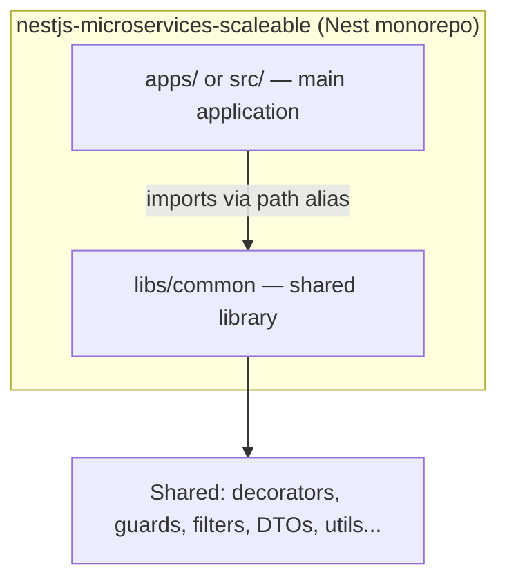
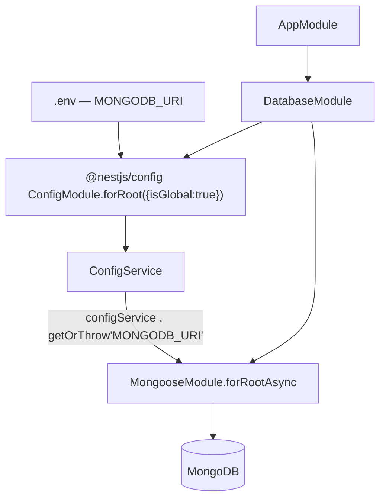
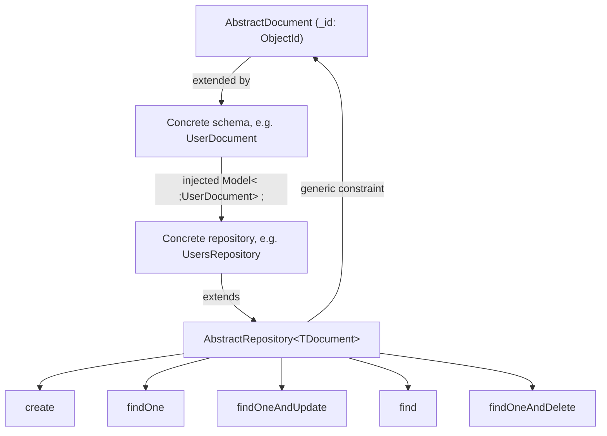

# nestjs-microservices-scaleable — Build Log

> Running, step-by-step record of everything done on this project, in order. Updated as i go.

---

## 📋 Steps Index

| # | Step                                                                                                                 | Purpose                                                                                              | Status                   |
|---|----------------------------------------------------------------------------------------------------------------------|------------------------------------------------------------------------------------------------------|--------------------------|
| 1 | [Create the Nest App (Monorepo Mode)](#step-1--create-the-nest-app-monorepo-mode)                                    | Lay the foundation as a monorepo so shared code can live in `libs/` and be reused by future services | ✅ Done                  |
| 2 | [Generate the `common` Library](#step-2--generate-the-common-library)                                                | Create the shared-code home (`@app/common`) that every future module/service will import from        | ✅ Done                  |
| 3 | [Config Module + Database Module (Mongoose + Joi)](#step-3--config-module--database-module-mongoose--joi)            | Validate required env vars and connect the app to MongoDB                                            | ⚠️ Done, wiring gap open |
| 4 | [Abstract Schema + Abstract Repository](#step-4--abstract-schema--abstract-repository-generic-mongoose-base-classes) | Generic Mongoose base classes so future feature repositories get CRUD for free                       | ✅ Done                  |

---

## Big Picture — Monorepo Structure



**Why monorepo mode:** a `libs/` folder means this isn't a single Nest app — it's set up so multiple services (or one
app + shared code) live in one repo and reuse the same compiled TypeScript path aliases, instead of publishing an npm
package for shared code.

---
---

# 🟦 STEP 1 — Create the Nest App (Monorepo Mode)

🎯 **Purpose:** start the project in **monorepo mode** (not a single-app mode) so that from day one there's a `libs/`
folder for shared code — the base this whole "scalable microservices" setup depends on.

```bash
nest new nestjs-microservices-scaleable
```

**What this generated:**

- `src/` — the main application (`main.ts`, `app.module.ts`, `app.controller.ts`, `app.service.ts`)
- `nest-cli.json` — the monorepo config file, currently:

```json
{
  "collection": "@nestjs/schematics",
  "sourceRoot": "src",
  "compilerOptions": {
    "deleteOutDir": true,
    "builder": "rspack"
  }
}
```

📌 **Notable non-default choices already in `package.json`:**

| Choice            | What you have             | Default Nest starter uses |
|-------------------|---------------------------|---------------------------|
| Bundler           | `rspack` (`@rspack/core`) | webpack                   |
| Test runner       | `vitest`                  | jest                      |
| Linter            | `oxlint`                  | eslint                    |
| Module system     | `"type": "module"` (ESM)  | CommonJS                  |
| Config validation | `joi`                     | (none by default)         |
| Nest version      | `^12.0.1`                 | —                         |

---
---

# 🟦 STEP 2 — Generate the `common` Library

🎯 **Purpose:** create one shared package (`@app/common`) that any future app or microservice in this repo can import
from — decorators, guards, DTOs, the config/database modules from Step 3 — instead of copy-pasting shared code into each
service or publishing an internal npm package.

```bash
nest g library common
```

**What this changed:**

```
libs/
└── common/
    ├── src/
    │   └── index.ts          # barrel file — re-export everything shared from here
    └── tsconfig.lib.json
```

`nest-cli.json` gained a `projects` entry:

```json
"projects": {
  "common": {
    "type": "library",
    "root": "libs/common",
    "entryFile": "index",
    "sourceRoot": "libs/common/src",
    "compilerOptions": {
      "tsConfigPath": "libs/common/tsconfig.lib.json"
    }
  }
}
```

**Why a library instead of a plain shared folder:** `nest g library` wires up a TypeScript path alias (e.g.
`@app/common`) automatically, so any future app/service in this monorepo can `import { X } from '@app/common'` instead
of a relative `../../../libs/common/...` path — this is what makes it scale to multiple microservices later.

---
---

# 🟦 STEP 3 — Config Module + Database Module (Mongoose + Joi)

🎯 **Purpose:** two separate concerns, both required before any real feature module can exist —

1. **Config Module:** make sure the app refuses to boot if a required env var (`MONGODB_URI`) is missing, instead of
   crashing later with a confusing runtime error.
2. **Database Module:** actually open the MongoDB connection via Mongoose, driven by that validated config, so feature
   modules (users, products, etc.) can start using `@InjectModel()`.



**Files added, both inside `libs/common/src/`, plus a root `.env`:**

```
nestjs-microservices-scaleable/
├── .env                       # already existed before this step — holds MONGODB_URI
└── libs/common/src/
    ├── config/
    │   └── config.module.ts      → nest g module config --project common   (or hand-written, as here)
    └── database/
        └── database.module.ts    → nest g module database --project common
```

### 3.0 — `.env` (root of the project)

```env
MONGODB_URI=mongodb://127.0.0.1/nest-microservies-scaleable
```

This is what `configService.getOrThrow('MONGODB_URI')` actually reads at runtime — without this file (or the var set
another way), `ConfigModule.forRoot()`'s Joi check would fail the app at boot, and `DatabaseModule` would throw on
`getOrThrow`.

### 3.1 — `config/config.module.ts`

```typescript
import { Module } from '@nestjs/common';
import { ConfigModule as NestConfigModule } from '@nestjs/config';
import Joi from 'joi';

@Module({
  imports: [
    NestConfigModule.forRoot({
      // WHY: fail fast at boot if MONGODB_URI is missing, instead of
      // getting a confusing Mongoose connection error later
      validationSchema: Joi.object({
        MONGODB_URI: Joi.string().required(),
      }),
    }),
  ],
})
export class ConfigModule {
}
```

### 3.2 — `database/database.module.ts`

```typescript
import { Module } from '@nestjs/common';
import { MongooseModule } from '@nestjs/mongoose';
import { ConfigModule, ConfigService } from '@nestjs/config';

@Module({
  imports: [
    ConfigModule.forRoot({ isGlobal: true }),

    MongooseModule.forRootAsync({
      imports: [ConfigModule],
      inject: [ConfigService],
      // WHY forRootAsync instead of forRoot: the URI comes from ConfigService,
      // which isn't ready at module-definition time — async factory waits for it
      useFactory: (configService: ConfigService) => ({
        uri: configService.getOrThrow<string>('MONGODB_URI'),
      }),
    }),
  ],
})
export class DatabaseModule {
}
```

### 3.3 — Wired into the app

```typescript
// src/app.module.ts
import { DatabaseModule } from '@app/common/database/database.module.js';

@Module({
  imports: [
    // ...ObserveModule...
    DatabaseModule,
  ],
})
```

📦 **Packages used here — checked against `package.json` AND `node_modules`, all already installed, none new:**
`@nestjs/config` (`^12.0.0`), `@nestjs/mongoose` (`^12.0.0`), `mongoose` (`^9.10.1`), `joi` (`^18.2.9`).

| File                          | Usage                                                                                                                          |
|-------------------------------|--------------------------------------------------------------------------------------------------------------------------------|
| `config/config.module.ts`     | A `ConfigModule` that validates `.env` against a Joi schema before the app boots — currently only checks `MONGODB_URI` exists. |
| `database/database.module.ts` | Opens the actual Mongoose/MongoDB connection using `MONGODB_URI` pulled from `ConfigService`.                                  |

> ⚠️ **Open issue — flagging, not changed:**
> `database.module.ts` calls `@nestjs/config`'s `ConfigModule.forRoot()` directly — it does **not** import your custom
> `config/config.module.ts`. So:
> - The Joi validation schema in `ConfigModule` isn't actually running anywhere yet.
> - `libs/common/src/index.ts` (the barrel) is still empty — `app.module.ts` reaches into the deep path
    `@app/common/database/database.module.js` instead of a clean `@app/common` import.

---
---

# 🟦 STEP 4 — Abstract Schema + Abstract Repository (Generic Mongoose Base Classes)

🎯 **Purpose:** stop writing the same CRUD (`create`, `findOne`, `findOneAndUpdate`, `find`, `findOneAndDelete`) by hand
in every future microservice's repository. `AbstractRepository<TDocument>` gives every feature repository (Users,
Orders, etc.) these methods for free just by extending it and injecting its own Mongoose model.



**Files added, inside `libs/common/src/database/`:**

```
libs/common/src/database/
├── database.module.ts      # existing — from Step 3
├── abstract.schema.ts       # shared _id field every schema extends
└── abstract.repository.ts   # generic CRUD every repository extends
```

### 4.1 — `abstract.schema.ts`

This schema defines the shared `_id` property using Mongoose types and is exported as `AbstractDocument` so all other
microservice schemas can extend it

```typescript
import { Prop, Schema } from '@nestjs/mongoose';
import { SchemaTypes, Types } from 'mongoose';

@Schema()
export abstract class AbstractDocument {
  // WHY: every concrete schema (User, Order, ...) needs a consistent
  // _id type — this base class is the single place that defines it
  @Prop({ type: SchemaTypes.ObjectId })
  _id: Types.ObjectId;
}
```

### 4.2 — `abstract.repository.ts`

This class implements common generic CRUD operations (`create`, `findOne`, `findOneAndUpdate`, `find`, and
`findOneAndDelete`) using Mongoose models and NestJS exception handling

```typescript
import { Logger, NotFoundException } from '@nestjs/common';
import { Model, QueryFilter, Types, UpdateQuery } from 'mongoose';
import { AbstractDocument } from '@app/common/database/abstract.schema.js';

export abstract class AbstractRepository<TDocument extends AbstractDocument> {
  protected abstract readonly logger: Logger;

  constructor(protected readonly model: Model<TDocument>) {
  }

  async create(document: Omit<TDocument, '_id'>): Promise<TDocument> {
    const createdDocument = new this.model({
      ...document,
      _id: new Types.ObjectId(),
    });
    return (await createdDocument.save()).toJSON() as unknown as TDocument;
  }

  async findOne(filterQuery: QueryFilter<TDocument>): Promise<TDocument> {
    const document = await this.model
      .findOne(filterQuery)
      .lean<TDocument>(true);

    if (!document) {
      this.logger.warn('Document was not found with filterQuery', filterQuery);
      throw new NotFoundException('Document not found');
    }

    return document;
  }

  async findOneAndUpdate(
    filterQuery: QueryFilter<TDocument>,
    update: UpdateQuery<TDocument>,
  ): Promise<TDocument> {
    const document = await this.model
      .findOneAndUpdate(filterQuery, update, { new: true })
      .lean<TDocument>(true);

    if (!document) {
      this.logger.warn('Document was not found with filterQuery', filterQuery);
      throw new NotFoundException('Document not found');
    }

    return document;
  }

  async find(filterQuery: QueryFilter<TDocument>): Promise<TDocument[]> {
    return this.model.find(filterQuery).lean<TDocument[]>(true);
  }

  async findOneAndDelete(
    filterQuery: QueryFilter<TDocument>,
  ): Promise<TDocument> {
    const document = await this.model
      .findOneAndDelete(filterQuery)
      .lean<TDocument>(true);

    // WHY: .lean<TDocument>() types as TDocument | null since the document
    // may not exist — narrow it here instead of returning the union, and
    // stay consistent with findOne/findOneAndUpdate's not-found behavior
    if (!document) {
      this.logger.warn('Document was not found with filterQuery', filterQuery);
      throw new NotFoundException('Document not found');
    }

    return document;
  }
}

```

📦 **Packages used here:** none new — `mongoose` and `@nestjs/mongoose` were already installed in Step 3.

| File                     | Usage                                                                                                                                                                                       |
|--------------------------|---------------------------------------------------------------------------------------------------------------------------------------------------------------------------------------------|
| `abstract.schema.ts`     | Base `AbstractDocument` class every concrete Mongoose schema extends, for a consistent `_id: ObjectId`.                                                                                     |
| `abstract.repository.ts` | Generic `AbstractRepository<TDocument>` with `create`, `findOne`, `findOneAndUpdate`, `find`, `findOneAndDelete` — concrete repositories extend it and inject their own `Model<TDocument>`. |

> ⚠️ **Open issue — flagging, not changed:**
> `findOneAndDelete` doesn't throw `NotFoundException` when nothing matches, unlike `findOne` and `findOneAndUpdate` —
> it silently returns `null`. Worth deciding if that's intentional (delete is idempotent-ish by nature) or a gap.

---

## Implementation Details

| `AbstractDocument Constraint` | `TDocument extends AbstractDocument` ensures that every generic repository instance works with a valid MongoDB document containing an `_id`                    |
|:-----------------------------:|----------------------------------------------------------------------------------------------------------------------------------------------------------------|
|  `Omit <TDocument, '\_id'>`   | Excludes `_id` from the creation payload because the `create` method explicitly generates `new Types.ObjectId()` internally                                    |
|         `lean(true)`          | Strips away Mongoose document hydration overhead, returning plain JavaScript objects for improved performance across query operations                          |
|  `Logging and 404 Exception`  | Logs a warning via `this.logger.warn` and throws NestJS's `NotFoundException` (which automatically yields a HTTP 404 response) whenever a document isn't found |

---

## 🧠 Mental Model — Steps 1-4 So Far

1. **Monorepo shell** (`libs/`) exists so shared code isn't copy-pasted.
2. **`@app/common` library** is the shared-code home, wired via a TS path alias.
3. **Config validates env vars, Database opens the Mongoose connection** — but the wiring gap from Step 3 (custom
   `ConfigModule` never actually imported) is still open.
4. **Abstract base classes** (`AbstractDocument`, `AbstractRepository`) mean every future feature module (Users,
   Orders, ...) gets `_id` + full CRUD for free by extending two classes instead of rewriting Mongoose boilerplate each
   time.


